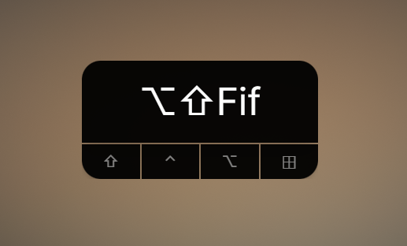
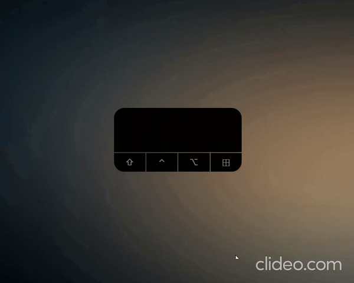
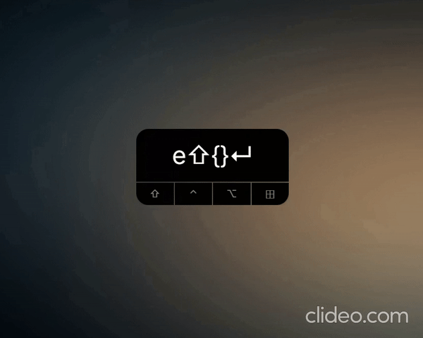

# Introduction

KeyReader - an open source keystroke visualizer that inspired from KeyCastr



KeyReader enables you to share your keystroke when streaming your screen. And yes, it looks like KetCastr. 
The only difference is that it supports **Windows**. 

For now, it only provide one theme as the above image

## Demo
Visit [homepage](https://hudy9x.github.io/keyreader/)

Enable to visualize typing




KeyReader allows you to moving around as well



# Installation
### For Windows 
Download the latest version from [here](https://github.com/hudy9x/keyreader/releases)

Or, install using [scoop](https://scoop.sh/)
```shell
$ scoop bucket add my-bucket https://github.com/hudy9x/scoop-buckets
$ scoop install keyreader
```

### For Linux
For now, follow Development guide to build your own.


### For Mac
Please use [KeyCastr](https://github.com/keycastr/keycastr) instead

# Upgrade 
### For Windows
If you already have KeyReader on your PC and you want to upgrade it's version

Follow the guide

```shell
$ scoop update
$ scoop update keyreader
```

Or, just download the latest version and re-install it

# Development
KeyReader built on [Tauri](https://tauri.app/). So, please follow their [instruction](https://tauri.app/v1/guides/getting-started/prerequisites) for installing development environment

Second, you must have `nodejs`, `npm` or `yarn`

After installing all above dev tools. Open terminal and start developing

```shell
$ npm run devapp
```

For building

```shell
$ npm run tauri build
```

# Issues
Please visit [issues](https://github.com/hudy9x/keyreader/issues)
Feel free to fork and make a PR for me

Note: I'm a new to Rust, so please help me improve the source code. Big thanks for good explanation, i'd love to learn from you guys

# License
[BSD 3-Clause](https://opensource.org/licenses/BSD-3-Clause)

KeyCastr has been freely available for the Windows since 2023.
